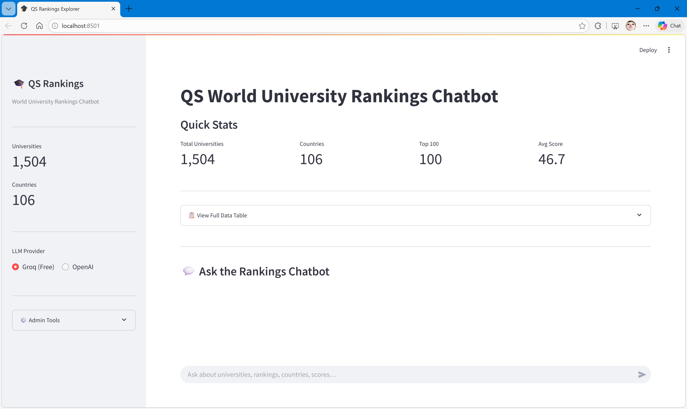
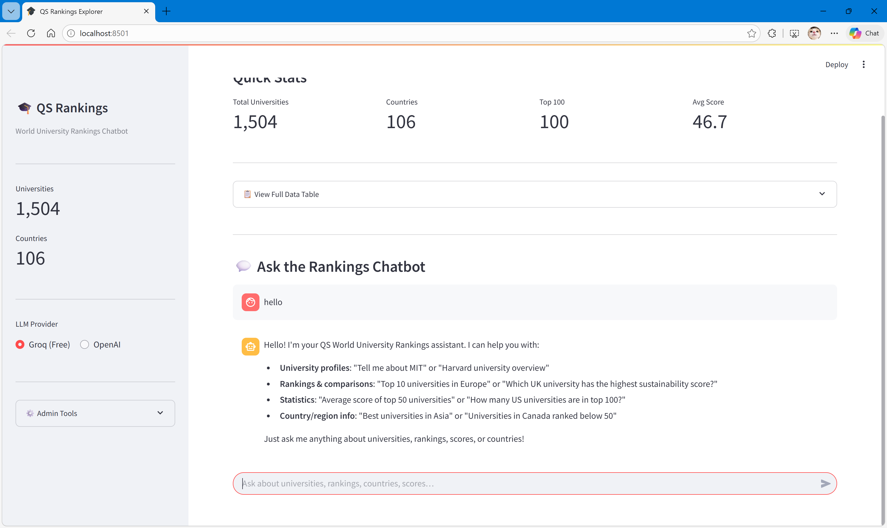
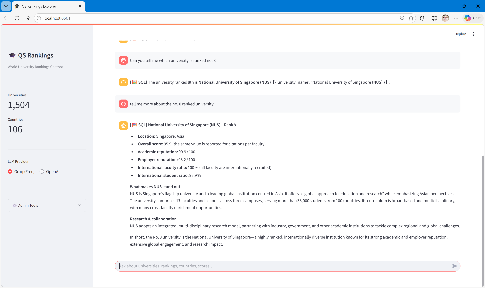

# QS World University Rankings Chatbot

An intelligent chatbot that helps users explore and query the QS World University Rankings data using natural language. The system combines web scraping, data processing, vector embeddings, and LLM-powered question answering with both RAG (Retrieval-Augmented Generation) and Text-to-SQL capabilities.

---

## Demo

https://github.com/user-attachments/assets/demo-chatbot.mp4

### Screenshots

| Landing Page | Basic Greeting | Working Demo |
|:---:|:---:|:---:|
|  |  |  |

---

## Table of Contents

- [Demo](#demo)
- [Overview](#overview)
- [Features](#features)
- [Project Structure](#project-structure)
- [Flow of Execution](#flow-of-execution)
- [Installation](#installation)
- [Usage](#usage)
- [Configuration](#configuration)
- [API Reference](#api-reference)
- [Data Schema](#data-schema)

---

## Overview

This project builds a conversational interface for exploring QS World University Rankings data. Users can ask natural language questions like:

- "Which UK university has the highest sustainability score?"
- "Tell me about MIT"
- "Top 10 universities in Asia"
- "Average overall score of universities in Germany"

The system intelligently routes queries to either:
- **RAG Path**: Semantic search using vector embeddings for descriptive/comparative queries
- **SQL Path**: Text-to-SQL generation for aggregation/mathematical queries
- **Profile Path**: Direct database lookup for university profile queries

---

## Features

- **Web Scraping**: Automated collection of QS rankings data using Playwright with stealth capabilities
- **Data Processing**: Cleaning, normalization, and SQLite database creation
- **Vector Embeddings**: ChromaDB with Sentence Transformers for semantic search
- **LLM Integration**: Supports both Groq (free) and OpenAI APIs
- **Natural Language Queries**: Ask questions in plain English
- **Intelligent Routing**: Automatically determines the best query processing method
- **University Profiles**: Detailed information including descriptions, reviews, and key facts
- **Clean Streamlit UI**: Chat-focused interface with quick stats and data exploration

---

## Project Structure

```
chatbot-elective/
│
├── app.py                 # Streamlit web application
├── chatbot.py             # RAG + Text-to-SQL query router
├── scraper.py             # Two-layer Playwright web scraper
├── pipeline.py            # Data cleaning and SQLite ingestion
├── embedder.py            # ChromaDB vector store builder
│
├── requirements.txt       # Python dependencies
├── .env                   # Environment variables (API keys)
│
├── data/
│   ├── raw/               # Scraped data (uncleaned)
│   │   ├── rankings_main.csv      # Layer A: University list + scores
│   │   └── rankings_detail.csv    # Layer B: Detailed profiles
│   │
│   ├── processed/         # Cleaned data
│   │   ├── rankings_main_cleaned.csv
│   │   ├── rankings_detail_cleaned.csv
│   │   ├── rankings_merged.csv    # Full joined dataset
│   │   └── qs_rankings.db         # SQLite database
│   │
│   └── chroma_db/         # Vector store persistence
│
└── logs/
    └── scraper.log        # Scraper warnings and errors
```

---

## Data Flow Architecture

### Flowchart

```
┌─────────────────────────────────────────────────────────────────────────────┐
│                           DATA COLLECTION LAYER                              │
├─────────────────────────────────────────────────────────────────────────────┤
│                                                                             │
│    ┌─────────────────┐                                                      │
│    │  QS Website     │    https://www.topuniversities.com                  │
│    │  (TopUniversities)│                                                    │
│    └────────┬────────┘                                                      │
│             │                                                               │
│             ▼                                                               │
│    ┌─────────────────────────────────────────────────────────────┐         │
│    │                     SCRAPER.PY                               │         │
│    │                                                              │         │
│    │  ┌──────────────────────────────────────────────────────┐   │         │
│    │  │ LAYER A: Main Rankings List                           │   │         │
│    │  │ • Strategy 0: Direct REST API (preferred)             │   │         │
│    │  │ • Strategy 1: Network interception (fallback)         │   │         │
│    │  │ • Strategy 2: DOM link scan (last resort)             │   │         │
│    │  │                                                        │   │         │
│    │  │ Extracts: rank, name, country, scores, detail URLs    │   │         │
│    │  └──────────────────────────────────────────────────────┘   │         │
│    │                          │                                   │         │
│    │                          ▼                                   │         │
│    │  ┌──────────────────────────────────────────────────────┐   │         │
│    │  │ LAYER B: Detail Pages (top 200 universities)         │   │         │
│    │  │                                                        │   │         │
│    │  │ Extracts:                                              │   │         │
│    │  │   • QS Lens scores (Research, Learning, etc.)         │   │         │
│    │  │   • University description                            │   │         │
│    │  │   • Key facts (type, founded, students)               │   │         │
│    │  │   • Student review snippets                           │   │         │
│    │  └──────────────────────────────────────────────────────┘   │         │
│    └─────────────────────────────────────────────────────────────┘         │
│                          │                                                  │
│                          ▼                                                  │
│             ┌────────────────────────┐                                     │
│             │   data/raw/            │                                     │
│             │   ├── rankings_main.csv│                                     │
│             │   └── rankings_detail.csv                                    │
│             └────────────┬───────────┘                                     │
│                          │                                                  │
└──────────────────────────┼──────────────────────────────────────────────────┘
                           │
                           ▼
┌─────────────────────────────────────────────────────────────────────────────┐
│                           DATA PROCESSING LAYER                              │
├─────────────────────────────────────────────────────────────────────────────┤
│                                                                             │
│             ┌─────────────────────────────────────┐                        │
│             │          PIPELINE.PY                │                        │
│             │                                     │                        │
│             │  1. CLEAN DATA                      │                        │
│             │     • Parse rank formats ("=42")    │                        │
│             │     • Clean score values            │                        │
│             │     • Map countries to continents   │                        │
│             │     • Handle missing values         │                        │
│             │                                     │                        │
│             │  2. SAVE CLEANED CSVs               │                        │
│             │     → data/processed/*_cleaned.csv  │                        │
│             │                                     │                        │
│             │  3. BUILD SQLITE DATABASE           │                        │
│             │     • universities table            │                        │
│             │     • university_details table      │                        │
│             │     • v_full_rankings view          │                        │
│             │                                     │                        │
│             └──────────────┬──────────────────────┘                        │
│                            │                                                │
│                            ▼                                                │
│             ┌────────────────────────┐                                     │
│             │   data/processed/      │                                     │
│             │   └── qs_rankings.db   │                                     │
│             └────────────┬───────────┘                                     │
│                          │                                                  │
└──────────────────────────┼──────────────────────────────────────────────────┘
                           │
                           ▼
┌─────────────────────────────────────────────────────────────────────────────┐
│                           EMBEDDING LAYER                                    │
├─────────────────────────────────────────────────────────────────────────────┤
│                                                                             │
│             ┌─────────────────────────────────────┐                        │
│             │         EMBEDDER.PY                 │                        │
│             │                                     │                        │
│             │  For each university:               │                        │
│             │                                     │                        │
│             │  1. Build rich document text        │                        │
│             │     (natural language paragraph     │                        │
│             │      combining all data)            │                        │
│             │                                     │                        │
│             │  2. Generate embeddings             │                        │
│             │     Model: all-MiniLM-L6-v2         │                        │
│             │     (384-dimensional vectors)       │                        │
│             │                                     │                        │
│             │  3. Store in ChromaDB               │                        │
│             │     • Cosine similarity             │                        │
│             │     • Persistent vector store       │                        │
│             │                                     │                        │
│             └──────────────┬──────────────────────┘                        │
│                            │                                                │
│                            ▼                                                │
│             ┌────────────────────────┐                                     │
│             │   data/chroma_db/      │                                     │
│             │   (Vector Store)       │                                     │
│             └────────────┬───────────┘                                     │
│                          │                                                  │
└──────────────────────────┼──────────────────────────────────────────────────┘
                           │
                           ▼
┌─────────────────────────────────────────────────────────────────────────────┐
│                           APPLICATION LAYER                                  │
├─────────────────────────────────────────────────────────────────────────────┤
│                                                                             │
│  ┌───────────────────────────────────────────────────────────────────────┐ │
│  │                           APP.PY (Streamlit)                           │ │
│  │                                                                        │ │
│  │  ┌─────────────┐  ┌─────────────────────────────────────────────────┐ │ │
│  │  │  Sidebar    │  │              Main Content                        │ │ │
│  │  │             │  │                                                 │ │ │
│  │  │ • Stats     │  │  ┌─────────────────────────────────────────┐   │ │ │
│  │  │ • LLM       │  │  │         Quick Stats Bar                 │   │ │ │
│  │  │   Provider  │  │  │  Universities | Countries | Top 100     │   │ │ │
│  │  │ • Admin     │  │  └─────────────────────────────────────────┘   │ │ │
│  │  │   Tools     │  │                                                 │ │ │
│  │  └─────────────┘  │  ┌─────────────────────────────────────────┐   │ │ │
│  │                    │  │         Data Table (expandable)         │   │ │ │
│  │                    │  └─────────────────────────────────────────┘   │ │ │
│  │                    │                                                 │ │ │
│  │                    │  ┌─────────────────────────────────────────┐   │ │ │
│  │                    │  │           💬 Chat Interface              │   │ │ │
│  │                    │  │                                         │   │ │ │
│  │                    │  │   User: "Top universities in UK?"       │   │ │ │
│  │                    │  │   Bot:  [SQL] Here are the top...       │   │ │ │
│  │                    │  │                                         │   │ │ │
│  │                    │  └─────────────────────────────────────────┘   │ │ │
│  │                    └─────────────────────────────────────────────────┘ │ │
│  └───────────────────────────────────────────────────────────────────────┘ │
│                                    │                                        │
│                                    ▼                                        │
│             ┌─────────────────────────────────────┐                        │
│             │         CHATBOT.PY                  │                        │
│             │                                     │                        │
│             │         Query Router                │                        │
│             │              │                      │                        │
│             │    ┌─────────┼─────────┐           │                        │
│             │    │         │         │           │                        │
│             │    ▼         ▼         ▼           │                        │
│             │ ┌──────┐ ┌──────┐ ┌────────┐      │                        │
│             │ │ RAG  │ │ SQL  │ │Profile │      │                        │
│             │ │ Path │ │ Path │ │  Path  │      │                        │
│             │ └──┬───┘ └──┬───┘ └───┬────┘      │                        │
│             │    │        │         │           │                        │
│             │    ▼        ▼         ▼           │                        │
│             │ ChromaDB  SQLite    SQLite        │                        │
│             │   + LLM   + LLM    + LLM          │                        │
│             └─────────────────────────────────────┘                        │
│                                                                             │
└─────────────────────────────────────────────────────────────────────────────┘
```

### Query Routing Logic

```
                    User Query
                        │
                        ▼
              ┌─────────────────┐
              │ Is it a greeting│──Yes──▶ Return friendly response
              │ or help request?│
              └────────┬────────┘
                       │ No
                       ▼
              ┌─────────────────┐
              │ Is it a math/   │
              │ aggregation     │──Yes──▶ TEXT-TO-SQL PATH
              │ query?          │         • Generate SQL
              │ (top, average,  │         • Execute on SQLite
              │  count, highest)│         • LLM summarizes results
              └────────┬────────┘
                       │ No
                       ▼
              ┌─────────────────┐
              │ Is it a profile │
              │ query?          │──Yes──▶ PROFILE PATH
              │ ("tell me about │         • Direct DB lookup
              │  MIT")          │         • Format structured data
              └────────┬────────┘         • LLM narrates profile
                       │ No
                       ▼
              ┌─────────────────┐
              │ RAG PATH        │
              │                 │
              │ • Embed query   │
              │ • Vector search │
              │ • Retrieve docs │
              │ • LLM answers   │
              └─────────────────┘
```

---

## Flow of Execution

This section explains the exact sequence to run the project from scratch.

### Execution Order

```
┌──────────────────────────────────────────────────────────────────┐
│                    REQUIRED EXECUTION ORDER                       │
├──────────────────────────────────────────────────────────────────┤
│                                                                   │
│   STEP 1: SETUP (one-time)                                       │
│   ├── Create virtual environment                                  │
│   ├── Install dependencies                                        │
│   ├── Install Playwright browsers                                 │
│   └── Configure .env with API keys                               │
│                                                                   │
│   STEP 2: SCRAPE DATA                                            │
│   ├── Run scraper.py                                             │
│   ├── Output: data/raw/rankings_main.csv                         │
│   └── Output: data/raw/rankings_detail.csv                       │
│                                                                   │
│   STEP 3: PROCESS DATA                                           │
│   ├── Run pipeline.py                                            │
│   ├── Cleans raw CSVs                                            │
│   └── Creates: data/processed/qs_rankings.db (SQLite)            │
│                                                                   │
│   STEP 4: BUILD EMBEDDINGS                                       │
│   ├── Run embedder.py                                            │
│   ├── Reads SQLite database                                      │
│   └── Creates: data/chroma_db/ (Vector Store)                    │
│                                                                   │
│   STEP 5: RUN APPLICATION                                        │
│   └── Run: streamlit run app.py                                  │
│                                                                   │
└──────────────────────────────────────────────────────────────────┘
```

### Two Ways to Run

#### Option A: Easy Way (Recommended for Beginners)

After completing **Step 1: Setup**, simply run:

```bash
streamlit run app.py
```

Then use the **Admin Tools** in the sidebar:
1. Click **"Run Scraper"** — downloads data (15-30 min)
2. The pipeline runs automatically after scraping
3. Click **"Rebuild Embeddings"** — creates vector store (2-5 min)
4. Start chatting!

#### Option B: Manual Way (Full Control)

Run each script sequentially from the command line:

```bash
# Step 2: Scrape data from QS website (15-30 minutes)
python scraper.py

# Step 3: Process and load into SQLite (1-2 minutes)
python pipeline.py

# Step 4: Build vector embeddings (2-5 minutes)
python embedder.py

# Step 5: Run the Streamlit app
streamlit run app.py
```

### Prerequisites Checklist

Before running anything, ensure you have:

| Requirement | How to Check | How to Fix |
|-------------|--------------|------------|
| Python 3.10+ | `python --version` | Install from python.org |
| Virtual env active | `(Scripts)` in terminal | Run `.venv\Scripts\activate` |
| Dependencies installed | `pip list` shows packages | `pip install -r requirements.txt` |
| Playwright browsers | `playwright --version` | `playwright install chromium` |
| API key configured | `.env` file exists | Copy from `.env.example` |

### Troubleshooting Common Issues

| Problem | Likely Cause | Solution |
|---------|--------------|----------|
| "No module named 'streamlit'" | Dependencies not installed | `pip install -r requirements.txt` |
| "Database not found" | Scraper/pipeline not run | Run Admin Tools → Run Scraper |
| "ChromaDB not found" | Embeddings not built | Run Admin Tools → Rebuild Embeddings |
| "API key invalid" | Missing/wrong API key | Check `.env` file |
| Scraper fails | Network/Playwright issues | Run `playwright install chromium` |

---

## Installation

### Prerequisites

- Python 3.10+
- Virtual environment (recommended)

### Setup

1. **Clone the repository**
   ```bash
   git clone <repository-url>
   cd chatbot-elective
   ```

2. **Create and activate virtual environment**
   ```bash
   python -m venv .venv

   # Windows
   .venv\Scripts\activate

   # Linux/Mac
   source .venv/bin/activate
   ```

3. **Install dependencies**
   ```bash
   pip install -r requirements.txt
   ```

4. **Install Playwright browsers** (for scraping)
   ```bash
   playwright install chromium
   ```

5. **Create `.env` file**
   ```env
   # Choose your LLM provider
   LLM_PROVIDER=groq

   # Groq (free tier available)
   GROQ_API_KEY=your_groq_api_key
   GROQ_MODEL=llama-3.3-70b-versatile

   # OR use OpenAI
   # LLM_PROVIDER=openai
   # OPENAI_API_KEY=your_openai_api_key
   # OPENAI_MODEL=gpt-4o-mini
   ```

---

## Usage

> **New users:** Follow the [Flow of Execution](#flow-of-execution) section above for step-by-step guidance.

### Running the App

```bash
# Windows
.venv\Scripts\streamlit.exe run app.py

# Linux/Mac
streamlit run app.py
```

### Quick Reference: All Commands

```bash
# Run individual scripts (in order)
python scraper.py      # Download data (15-30 min)
python pipeline.py     # Process into SQLite (1-2 min)
python embedder.py     # Build vector store (2-5 min)
streamlit run app.py   # Launch web app
```

### Example Queries

| Query Type | Example |
|------------|---------|
| Greeting | "Hello", "Hi", "Help" |
| Profile | "Tell me about Stanford", "MIT overview" |
| Rankings | "Top 10 universities in Europe" |
| Aggregation | "Average score of UK universities" |
| Comparison | "Which has better sustainability: Oxford or Cambridge?" |
| Statistics | "How many US universities are in top 100?" |

---

## Configuration

### Scraper Settings (`scraper.py`)

```python
MAX_LAYER_A = 1504  # Total universities to scrape
MAX_LAYER_B = 200   # Detail pages to scrape (time-intensive)
```

### Embedding Settings (`embedder.py`)

```python
EMBEDDING_MODEL = "all-MiniLM-L6-v2"  # Sentence transformer model
BATCH_SIZE = 100                       # Embedding batch size
```

### LLM Settings

Configured via `.env` file or Streamlit sidebar.

---

## Data Schema

### SQLite Database Tables

#### `universities` table
| Column | Type | Description |
|--------|------|-------------|
| id | INTEGER | Primary key |
| rank | INTEGER | Global ranking (1 = best) |
| university_name | TEXT | University name |
| country | TEXT | Country name |
| continent | TEXT | Continent (derived) |
| overall_score | REAL | Overall QS score (0-100) |
| academic_reputation | REAL | Academic reputation score |
| employer_reputation | REAL | Employer reputation score |
| citations_per_faculty | REAL | Citations per faculty score |
| intl_faculty_ratio | REAL | International faculty ratio |
| intl_student_ratio | REAL | International student ratio |
| detail_url | TEXT | URL to university detail page |
| scraped_at | TEXT | Timestamp of scrape |

#### `university_details` table
| Column | Type | Description |
|--------|------|-------------|
| id | INTEGER | Primary key |
| university_id | INTEGER | Foreign key to universities |
| research_discovery | REAL | QS Lens: Research score |
| learning_experience | REAL | QS Lens: Learning score |
| employability | REAL | QS Lens: Employability score |
| global_engagement | REAL | QS Lens: Global engagement |
| sustainability | REAL | QS Lens: Sustainability score |
| description | TEXT | University description |
| university_type | TEXT | Public/Private |
| founded_year | TEXT | Year founded |
| total_students | TEXT | Total enrollment |
| student_faculty_ratio | TEXT | e.g., "12:1" |
| review_snippets | TEXT | Student reviews |
| scraped_at | TEXT | Timestamp of scrape |

#### `v_full_rankings` view
Joined view of both tables for easy querying.

---

## API Reference

### `chatbot.chat()`

Main entry point for the chatbot.

```python
from chatbot import chat

answer, reference_cards, query_type = chat(
    user_query="Top universities in Germany",
    filter_country=None,      # Optional country filter
    filter_continent=None,    # Optional continent filter
    n_results=5               # Number of RAG results
)
```

**Returns:**
- `answer` (str): The chatbot's response
- `reference_cards` (list[dict]): University data cards for UI
- `query_type` (str): One of "rag", "sql", "profile", "greeting", "error"

---

## License

This project is for educational purposes. Data sourced from [QS TopUniversities](https://www.topuniversities.com).

---

## Acknowledgments

- [QS World University Rankings](https://www.topuniversities.com) for the data
- [Sentence Transformers](https://www.sbert.net) for embeddings
- [ChromaDB](https://www.trychroma.com) for vector storage
- [Groq](https://groq.com) and [OpenAI](https://openai.com) for LLM APIs